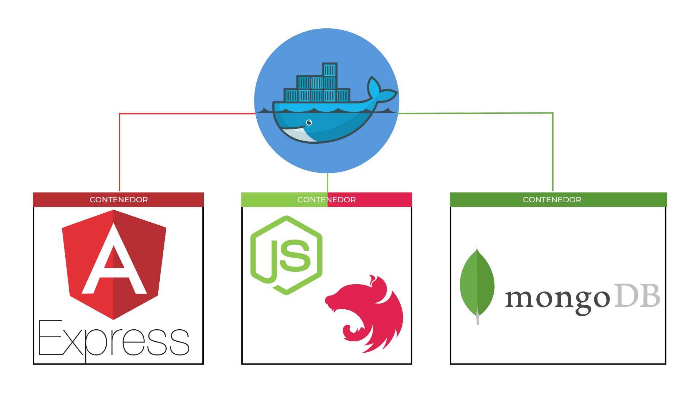

<p align="center"></p>

## REQUERIMIENTOS GENERALES DEL PROYECTO
- Angular: v13.1.4
- Node: v16.16.0
- Typescript instalado de forma global
- Docker Desktop instalado (Revisar requisitos de instalación) 

## CONFIGURACIONES ANTES DE CREAR DOCKERS

#### CONFIGURACION DE VARIABLE DE ENTORNO 

```sh
cd client/SSR-EXPRESS/src/environment
```
- Abrir archivo environment.prod.ts y cambiar la IP de la url del docker a la IP de la máquina donde se instalar el docker.

- Nota: Usar en el CMD comando ipconfig y copiar la dirección IPV4 y reemplazarla en el archivo environment.prod.ts

## Generar carpetas /dist en cada cliente
#### SSR (EXPRESS)
- Ingresa a la carpeta del cliente express
```sh
cd client/SSR-EXPRESS
```

#### Ejecutar el comando

```sh
tsc
```
- Advertencia: para realizar esto debes tener instalado Typescript de manera global, para ello ejecuta el siguiente comando en cmd:

	```sh
	npm i -g typescript
	```
#### CSR (ANGULAR)
- Ingresa a la carpeta del cliente angular
```sh
cd client/CSR-ANGULAR
```

#### Ejecutar el comando

```sh
ng build
```

## COMANDOS PARA CRACION Y EJECUCION DE DOCKERS

### CSR
- Ingresa a la carpeta del cliente angular
```sh
cd client/CSR-ANGULAR
```
- Crear imagen
```sh
docker build -t csr-angular .
```
- Lanza la imagen enun contenedor
```sh
docker run -d -it -p 80:80/tcp csr-angular
```
### SSR
- Ingresa a la carpeta del cliente express
```sh
cd client/SSR-EXPRESS
```
- Crear imagen
```sh
docker build -t ssr-express .
```
- Lanza la imagen enun contenedor
```sh
docker run -it -p 4000:4000 ssr-express
```

## SERVIDOR

- En el proyecto existen dos servidores, uno en NESTJS (Monolítico) y el otro en EXPRESS (MICROSERVICIO)
- Ingresa a la carpeta del principal que contiene los dos servicios api
```sh
cd server
```
- Crear imagen del docker-compose y lanzamos la misma con el siguiente ocmando:
```sh
docker-compose up --build
```
- En caso que se desee vovler a lanzar la imagen de nuevo en un contenedor, utilizamos:
```sh
docker-compose up
```